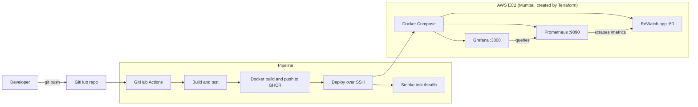

# ReWatch: End-to-End DevOps Pipeline (FA2)

ReWatch is a personal media tracker for movies, TV shows, anime and books. It has ratings, notes, genre tags, a stats dashboard and a "what to watch next" suggestion.

This repository demonstrates a complete DevOps lifecycle around the app: **source, build, test, containerization, deployment, monitoring and alerting**. A single `git push` tests the code, packages it, deploys it to AWS and makes it observable.

---

## 1. Problem statement

Small applications are often deployed by hand: someone copies files to a server, restarts a process and hopes nothing broke. This is slow, error-prone and impossible to repeat reliably, and nobody knows the app is down until a user complains.

**DevOps need addressed:** automate the path from a developer's laptop to a live server, make the environment reproducible from code, and continuously measure the health of the running system.

## 2. Architecture



## 3. Tools and why each is used

| Stage | Tool | Purpose |
|---|---|---|
| Source control | Git, GitHub | Versioned code, infrastructure and pipeline definitions |
| Build and test | GitHub Actions, Node.js test runner, Supertest | Automated tests on every push; a failing test stops the pipeline |
| Containerization | Docker, Docker Compose | The app runs identically on a laptop, in CI and on the server |
| Registry | GitHub Container Registry | Stores images tagged `latest` and with the commit SHA |
| Infrastructure as Code | Terraform | Creates the EC2 server and firewall (security group) from code |
| Configuration management | Ansible | Installs Docker, fetches the code, writes secrets, starts the stack |
| Orchestration | Kubernetes (minikube) | 2 replicas, health probes, self-healing |
| Monitoring | Prometheus | Scrapes application metrics every 15 seconds and evaluates alert rules |
| Visualization | Grafana | Auto-provisioned dashboard |

## 4. CI/CD pipeline

Defined in `.github/workflows/ci-cd.yml`:

1. **build-test:** installs dependencies and runs the automated tests (health check, authentication guard, metrics endpoint).
2. **docker:** builds the image and pushes it to `ghcr.io/tanmay2422/rewatch` (only after tests pass, only on pushes).
3. **deploy:** connects to the EC2 server over SSH, pulls the new code and image, and restarts the containers with Docker Compose.
4. **Smoke test:** calls `/health` on the live server to confirm the deployment worked.

Deployments are serialized with a `concurrency` group so two runs never restart the same containers at once.

## 5. Monitoring and observability (SRE)

The app exposes Prometheus metrics at `/metrics`:

- `rewatch_http_requests_total` (labels: method, route, status)
- `rewatch_http_request_duration_seconds` (latency histogram)
- Default process metrics: CPU, memory, event loop

**Grafana dashboard "ReWatch Overview"** shows requests per second per route, 5xx error rate, p95 latency, app up/down, memory and CPU.

**Alert rules** (`monitoring/alerts.yml`):

| Alert | Condition | Meaning |
|---|---|---|
| `RewatchDown` | target `up == 0` for 1 minute | Service is unavailable |
| `HighErrorRate` | 5xx rate above 0.1/s for 2 minutes | Users are seeing server errors |

These act as our service-level indicators for availability and errors.

## 6. Repository structure

```
.
├── backend/                 # Express app, SQLite, static frontend, tests
│   ├── src/                 # index.js (routes + /metrics), db.js, auth.js, posters.js
│   ├── public/              # frontend pages
│   └── test/app.test.js     # automated tests
├── Dockerfile
├── docker-compose.yml       # app + Prometheus + Grafana
├── monitoring/              # prometheus.yml, alerts.yml, Grafana provisioning + dashboard
├── k8s/rewatch.yaml         # Deployment (2 replicas, probes) + Service
├── terraform/               # EC2 + security group
├── ansible/deploy.yml       # server configuration and deployment
└── .github/workflows/ci-cd.yml
```

## 7. How to run it

### Locally with Docker Compose

```bash
docker compose up -d --build
```

| URL | What |
|---|---|
| http://localhost | ReWatch app (demo login: `demo` / `demo1234`) |
| http://localhost:9090 | Prometheus (Status, then Targets) |
| http://localhost:3000 | Grafana (`admin` / `admin`) |

### Tests

```bash
cd backend
npm install
npm test
```

### On Kubernetes (minikube)

```bash
minikube start --driver=docker
kubectl apply -f k8s/rewatch.yaml
kubectl get pods
minikube service rewatch --url
```

### On AWS

```bash
# 1. Create the server
cd terraform
terraform init
terraform apply -var="ssh_cidr=<YOUR_IP>/32"

# 2. Configure and deploy (Ansible, run from Linux or WSL)
cd ../ansible
cp inventory.ini.example inventory.ini     # add the server IP and key path
ansible-playbook -i inventory.ini deploy.yml -e session_secret=<random> -e omdb_api_key=<optional>
```

After this, every push to `main` redeploys automatically. The pipeline needs two repository secrets: `EC2_HOST` and `EC2_SSH_KEY`.

To remove everything and stop AWS charges: `terraform destroy -var="ssh_cidr=<YOUR_IP>/32"`.

## 8. Security notes

- Secrets (SSH key, session secret, API keys) are never committed. `.gitignore` excludes `*.pem`, `.env` and `ansible/inventory.ini`; Ansible writes `.env` on the server only.
- Only port 80 is open to the world. Grafana (3000) and Prometheus (9090) are restricted to the operator's IP by the Terraform security group.
- SSH (22) is open so the GitHub-hosted runner can deploy; login requires the private key. For production this would be replaced by a self-hosted runner or a restricted network path.
- Pipeline secrets are stored in GitHub Actions encrypted secrets.

## 9. App API

| Method | Route | Description |
|---|---|---|
| GET | `/health` | Liveness check |
| GET | `/metrics` | Prometheus metrics |
| POST | `/api/auth/signup`, `/api/auth/login`, `/api/auth/logout` | Authentication |
| GET | `/api/entries` | List entries (`?status=`, `?type=`, `?genre=`, `?search=`, `?sort=`, `?order=`) |
| POST / PATCH / DELETE | `/api/entries[/:id]` | Create, update, delete |
| GET | `/api/stats` | Dashboard numbers |
| GET | `/api/suggestion` | "What to watch next" |
